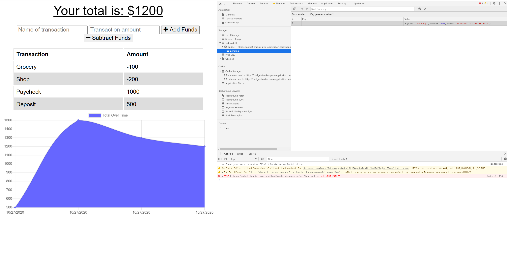

# Budget-Tracker

## The Repository

The link to the website repository: [Website Repo link](https://github.com/NavdeepDP/Budget-Tracker)

The link to deployed website [Website Link](https://budget-tracker-pwa-application.herokuapp.com/)

## Development Environment using 
- Code is developed in VS code Studio using   Node, Express, MongoDB  and Mongoose.
- This is an Progressive Web Application.(includes manifest.webmanifest, service-worker.js, webpack)
- Application is deployed using Heroku and MongoDB Atlas.

## Website Functionality

The user will be able to add expenses and deposits to their budget with or without a connection. When entering transactions offline, they should populate the total when brought back online.

Offline Functionality:

  * Enter deposits offline

  * Enter expenses offline

When brought back online:

  * Offline entries should be added to tracker.

## Installation

- Code is developed using VS Code studio.
- Code is available at the GITHub repository link: [Website Repo link](hhttps://github.com/NavdeepDP/Budget-Tracker)
- Get the code code in your local machine by using the clone option in the repository link.
- Click "Code" and copy the Clone with SSH key link.
- In Git bash, go to the appropriate directory and get the code using "git clone" command.
- In Vs Code terminal , go to the project directory.
- Run "npm install" - it will install all the packages(inquirer for this application) required for the application.  

## Test your application
Start the server: node server.js
Visit http://localhost:3000 and confirm that the application works correctly.
In Robo 3T, confirm that after adding an entry to your budget, that you now see a budget database and a transactions collection.
Robo 3T

### Offline Storage with IndexedDB
Test that the app works offline by setting your Network tab to Offline and adding a transaction. You should see the http call fail, but the transaction still appears on the screen.
Offline Failed http Call.

Additionally, you should see your transaction stored in the IndexedDB under Application -> Storage -> IndexedDB -> budget - http://localhost:3000 -> pending

### Confirm your application is reading your service worker by visiting the Application tab and clicking Service Workers.
Refresh the page twice. Now, you should see both your static-cache and your data-cache in the Cache Storage section.

### Static Cache Data Cache
Confirm you are able to access application offline by selecting Service Workers, and checking the "Offline" checkbox.

## References

- [w3schools.com](https://www.w3schools.com/)
- [MDN web docs](https://developer.mozilla.org/en-US/docs/Web/JavaScript)
- [Inquirer](https://www.npmjs.com/package/inquirer#methods)
- [Nodejs Links](https://nodejs.org/dist/latest-v12.x/docs/api/index.html)
- [Express](https://expressjs.com/en/5x/api.html)
- [Express Handlebars](https://www.npmjs.com/package/express-handlebars)
- [Mongoose Virtual](https://mongoosejs.com/docs/tutorials/virtuals.html)
- [MDN Web App Manifest documentation](https://developer.mozilla.org/en-US/docs/Web/Manifest) 
- [Manifest](https://github.com/arthurbergmz/webpack-pwa-manifest)

